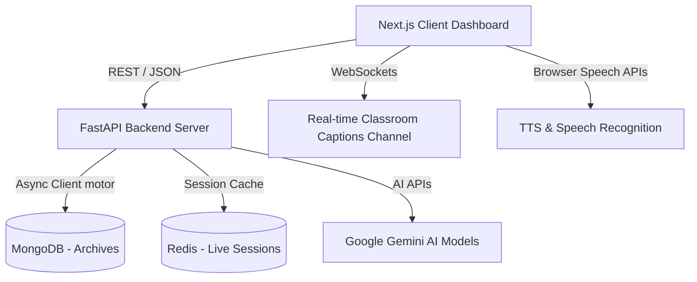

# Access AI: Learn Without Barriers

Access AI is a production-grade, accessibility-first AI learning platform designed for university hackathons under the problem statement: **Inclusive Learning Technologies for Differently-Abled Individuals**. It features a unified, responsive interface that dynamically adapts to the needs of students (blind, hearing-impaired, dyslexic, language-barrier, and neurotypical) via multi-mode accessibility settings and natural voice control.

---

## 🚀 Quick Start (Zero-Setup Demo Mode)

Access AI is engineered with **dual-mode adapters**. If database services or AI API keys are not installed, the platform automatically switches to high-fidelity local client simulations and mock generators. This ensures a **flawless, instant demo** for university judges without complex setup hurdles.

### 1. Run the FastAPI Backend
Ensure you have Python 3.9+ installed.
```bash
cd access-ai-backend
pip install -r requirements.txt
python run.py
```
*The backend service will boot at `http://127.0.0.1:8000`.*

### 2. Run the Next.js Frontend
Ensure you have Node.js 18+ installed.
```bash
cd access-ai-frontend
npm run dev
```
*The frontend dashboard will boot at `http://localhost:3000`.*

---

## 🛠️ Technology Stack & Architecture



### Frontend Services
- **React & Next.js (App Router)**: Fast rendering, SEO optimization, and file routing.
- **Tailwind CSS**: Glassmorphic layout classes, animations, and high contrast designs.
- **Framer Motion**: Smooth entry micro-animations and cards scaling.
- **Web Speech API**: Handles client-side Speech Synthesis and speech command recognitions.

### Backend Services
- **FastAPI**: Asynchronous REST endpoints and WebSocket manager.
- **MongoDB & Redis**: Persistent storage for lecture notes transcripts, and session cache.
- **Gemini API Integration**: Used for AI tutoring, PDF paragraph summaries, OCR simplification, and quiz generations.

---

## 🎨 Design Aesthetics & Accessibility Compliance

Access AI follows premium design patterns:
1. **WCAG Color Contrast**: Switch to High Contrast Dark Mode (`dark high-contrast` body class) instantly via voice or the settings panel. All buttons receive a thick outline and solid black backgrounds.
2. **OpenDyslexic typography support**: Toggling Dyslexia Mode adjusts spacing rules:
   - Alternates default fonts to clean comic-glyph layouts (`font-dyslexic` CSS class).
   - `letter-spacing: 0.16em` and `word-spacing: 0.32em` to prevent character rotations.
   - Reading Ruler overlays tracking mouse coordinates for row alignment.
   - Mix-blend multiply background filters (yellow, blue, pink) to reduce visual fatigue.
3. **Screen Reader Integration**: Every dashboard card announces its name and description out loud when focused via keyboard navigation.

---

## 🏆 Hackathon Judges' Demo Guide

Follow this 3-Minute flow during evaluations to demonstrate the full capabilities of the platform:

### Step 1: The First Impression (Voice Assistant Wake-up)
- **Action**: Open the dashboard at `http://localhost:3000`.
- **Judges see**: A glassmorphic dashboard loading. After 1.5 seconds, the AI Voice Assistant will play a soft sound and announce:
  > *"Hello. Welcome to Access AI. I am your AI Learning Assistant. How can I help you today? You can speak naturally or use the keyboard."*
- **Speech prompt**: Say clearly: *"Open AI Tutor"*
- **Result**: The assistant responds *"Opening AI Tutor"* and routes directly to the tutor page.

### Step 2: Adaptive Settings (Dyslexia & High Contrast)
- **Action**: Click the "Accessibility Settings" pill in the top-right.
- **Toggles to show**:
  1. Toggle **OpenDyslexic Font** & **Reading Ruler**: Show the reading line follow your cursor. Explain: *"This aids students with dyslexia or attention difficulties in focusing."*
  2. Toggle **Color Tints** (e.g. Yellow Overlay): Show the screen background color shifting.
  3. Toggle **Vision Assist**: Font size increases to large, and the dark high-contrast mode activates immediately.

### Step 3: Real-Time Classroom Subtitles (Hearing Assist)
- **Action**: Navigate to the "Live Classroom" tab.
- **Click**: *"Start Transcribing"* (Teacher starts speaking).
- **Speech prompt**: Speak clearly into the microphone: *"Today we will learn Machine Learning. Machine Learning is a branch of Artificial Intelligence."*
- **Result**:
  - Chat bubbles containing the sentences appear continuously with timestamps.
  - The subtitles window at the bottom displays large-format text.
  - Real-time translations into Telugu appear below each segment.
- **Click**: *"Save Lecture"* to save the transcript to the database.

### Step 4: AI Lesson Summary & Interactive Quizzes
- **Action**: Inside the classroom page, click the **"AI Study Notes"** tab.
- **Judges see**:
  1. An executive summary and bullet points.
  2. Interactive flip flashcards (click to rotate and reveal terms).
  3. An interactive quiz. Click a correct option and show the **gorgeous confetti animations** bursting!

### Step 5: Indoor Navigation Assistant (Vision Assist)
- **Action**: Go to the **"Object Detection"** page.
- **Action**: Click *"Activate Camera System"*.
- **Judges see**:
  - The camera frame overlaying bounding boxes around classroom equipment.
  - Navigational prompts are read aloud automatically: *"Chair detected nearby on your right. Steer slightly left."*

---

## 🔮 Future Development Roadmap

1. **Offline Whisper Support**: Pack lightweight whisper.cpp models for speech-to-text without internet connections.
2. **Native YOLOv8 WebAssembly Integration**: Run model inference locally in the browser utilizing ONNX Runtime Web.
3. **Multi-device Broadcast Sync**: Support classroom audio-casting where teachers cast audio streams to student browsers simultaneously.
